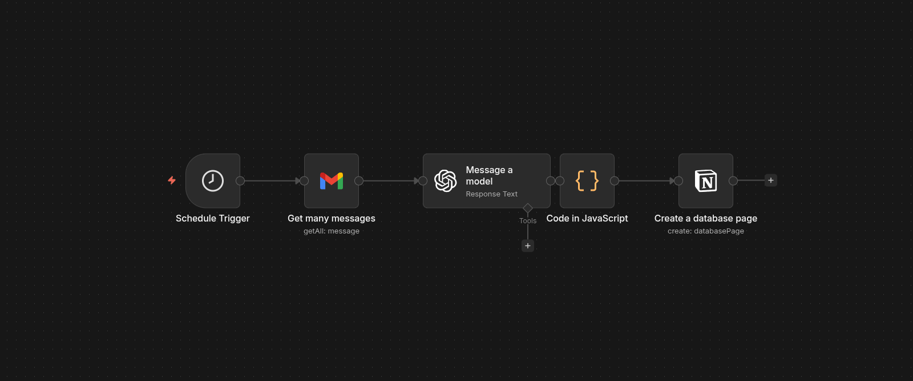

# AI-Powered Job Application Tracker

Automação desenvolvida com n8n para rastrear candidaturas de vagas automaticamente utilizando Gmail, IA e Notion. O workflow monitora emails enviados e recebidos relacionados a vagas de emprego, extrai informações relevantes utilizando LLMs e mantém uma base atualizada no Notion funcionando como um ATS pessoal.

## Objetivo
Centralizar e automatizar o acompanhamento de candidaturas sem necessidade de atualização manual.

